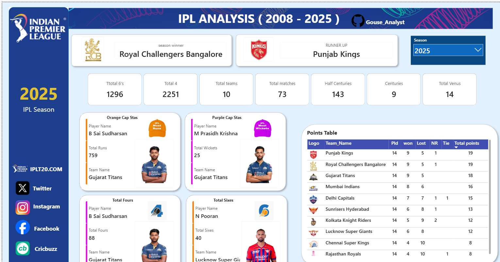

# 🏏 IPL Analytics Dashboard (2008–2025) | Power BI

An end-to-end **Power BI Dashboard** that provides interactive insights into the Indian Premier League (IPL) from **2008 to 2025**. This dashboard allows users to explore team performance, player achievements, tournament statistics, and season-wise trends using dynamic filters and KPIs.

---

## 📸 Dashboard Preview

> Replace the image path below with your uploaded screenshot.



---

# 📌 Project Overview

This project transforms raw IPL match and ball-by-ball data into an interactive dashboard using **Power BI**, **Power Query**, and **DAX**. Every visual updates dynamically based on the selected IPL season (2008–2025), allowing users to analyze tournament outcomes, player performances, and team statistics.

---

# ✨ Features

### 📅 Dynamic Season Filter
- Analyze any IPL season from **2008 to 2025**
- All KPIs, cards, tables, and visuals update dynamically

### 🏆 Tournament Information
- Season Winner
- Runner-up Team
- Team Logos

### 📊 Tournament KPIs
- Total Sixes
- Total Fours
- Total Teams
- Total Matches
- Half Centuries
- Centuries
- Total Venues

### 🟠 Orange Cap Analysis
- Orange Cap Holder
- Team Name
- Total Runs
- Player Image

### 🟣 Purple Cap Analysis
- Purple Cap Holder
- Team Name
- Total Wickets
- Player Image

### 💥 Batting Records
- Most Fours
- Most Sixes

### 📈 Dynamic Points Table
Displays for the selected season:
- Team Logo
- Team Name
- Matches Played
- Matches Won
- Matches Lost
- No Result
- Tie Matches
- Total Points

---

# 🛠 Technologies Used

- Microsoft Power BI
- Power Query
- DAX (Data Analysis Expressions)
- Microsoft Excel
- Data Modeling
- Git & GitHub

---

# 📂 Dataset

The dashboard is built using multiple IPL datasets, including:

- IPL Matches
- Ball-by-Ball Data
- Teams Data
- Players Data

---

# 🧹 Data Preparation

The following transformations were performed using Power Query:

- Removed duplicate records
- Fixed data type issues
- Removed null values
- Cleaned text columns
- Created custom columns
- Validated relationships
- Optimized data model

---

# 🔗 Data Model

The dashboard uses a relational data model consisting of:

- `ipl_matches_data`
- `ball_by_ball_data`
- `teams_data`
- `players_data`

Relationships were created to enable dynamic filtering and accurate DAX calculations.

---

# 📐 DAX Measures

Some of the custom DAX measures used include:

- Matches Played
- Matches Won
- Matches Lost
- Total Points
- Orange Cap Holder
- Purple Cap Holder
- Most Sixes
- Most Fours
- Total Matches
- Total Teams
- Total Venues
- Half Centuries
- Centuries

---

# 📊 Interactive Features

- Dynamic Season Slicer (2008–2025)
- Interactive KPI Cards
- Team Logos
- Player Images
- Dynamic Points Table
- Responsive Visuals
- Professional Dashboard Design

---

# 💼 Skills Demonstrated

- Data Cleaning
- Data Transformation
- Data Modeling
- DAX
- Power Query
- Dashboard Design
- Business Intelligence
- Data Visualization
- Interactive Reporting

---

# 📁 Repository Structure

```
IPL-Analytics-Dashboard-PowerBI
│
├── README.md
├── IPL_Dashboard_Data_Analysis.pbix
│
├── images
│   └── dashboard.png
│
├── data
│   ├── ipl_matches_data.csv
│   ├── ball_by_ball_data.csv
│   ├── teams_data.csv
│   └── players_data.csv
│
└── docs
    └── Project_Report.pdf
```

---

# 🚀 How to Use

1. Clone or download this repository.
2. Open `IPL_Dashboard_Data_Analysis.pbix` in **Power BI Desktop**.
3. Refresh the dataset if required.
4. Select any IPL season (2008–2025) from the slicer.
5. Explore the interactive dashboard.

---

# 📈 Key Insights

- Compare team performance across IPL seasons.
- Analyze Orange Cap and Purple Cap winners.
- Explore batting achievements such as most sixes and fours.
- View tournament statistics including matches, venues, and centuries.
- Track team standings through a dynamic points table.

---

# 📬 Contact

**Syed Gouse Ahamad**

- GitHub: https://github.com/gouse-analyst

If you found this project useful, consider giving it a ⭐ on GitHub!
